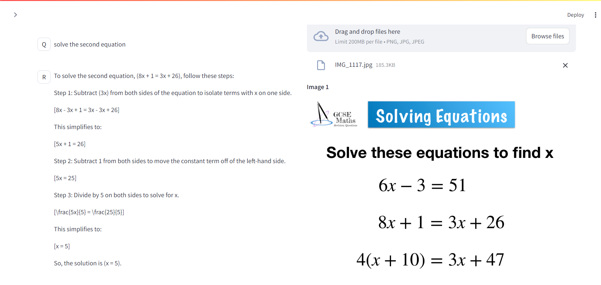
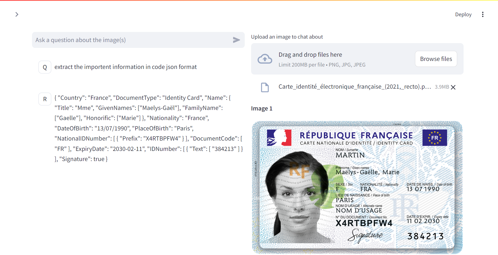
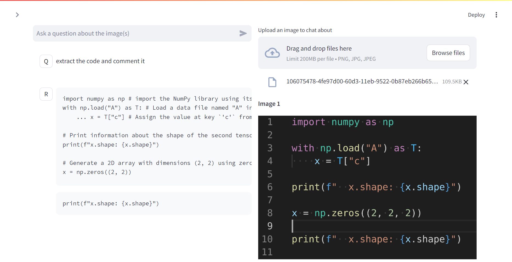

# Vision Chatbot 

This project integrates a **Vision-Language Model (VLM)** powered **chatbot** that interacts with images, answering questions and providing insights.
### 🚀 Superior Efficiency

## Table of Contents
1. [Project Overview](#1-project-overview)
   - [Vision Chatbot](#vision-chatbot)
2. [System Requirements](#2-system-requirements)
3. [Installation Steps](#3-installation-steps)
   - [Step 1: Download Ollama](#31-step-1-download-ollama)
   - [Step 2: Download Required Models](#32-step-2-download-required-models)
   - [Step 3: Run the Application](#33-step-3-run-the-application)
4. [Offline Usage](#4-offline-usage)

## 1. Project Overview

### Vision Chatbot
- The chatbot utilizes LangChain and Ollama to interpret and respond to user queries related to images.
- It leverages a **Vision-Language Model (VLM)** to understand image content and answer questions, enabling an interactive experience with images.
- **Key Features**:
  - Real-time image analysis.
  - Multimodal interactions: text and images.
  ## Screenshot of the Chatbot in Action
### 💪 Strong OCR Capability

### 🔥 Leading Performance


## 2. System Requirements

The machine used for this project has the following specifications:

- **GPU**: NVIDIA GPU with **6GB+ VRAM** (recommended for efficient chatbot functionality).
- **CUDA Version**: **12.6**.
- **RAM**: **16GB** (Higher RAM will improve performance).
- **Disk Space**: At least **5GB free** for the application and models.

### **Better Performance**
- A **more powerful GPU** (with more VRAM) will lead to faster processing and better chatbot performance, especially when dealing with large images or complex queries.
- **More RAM** (32GB or higher) can help improve overall system responsiveness, especially when running multiple applications alongside the chatbot.

## 3. Installation Steps

### 3.1 Step 1: Download Ollama
To enable chatbot functionality, first download and install **Ollama**. Visit the official website and follow the installation instructions.

- **Download Ollama**: [Here](https://www.ollama.com).

### 3.2 Step 2: Download Required Models
After installing Ollama, download the necessary models. For example, to download the `minicpm-v` model, run:
```bash
ollama pull minicpm-v
```

### 3.3 Step 3: Run the Chatbot
Once the models are downloaded, you can start the chatbot application using Streamlit. Open a terminal in the project directory and run the following command:
```bash
streamlit run chatbot.py
```
